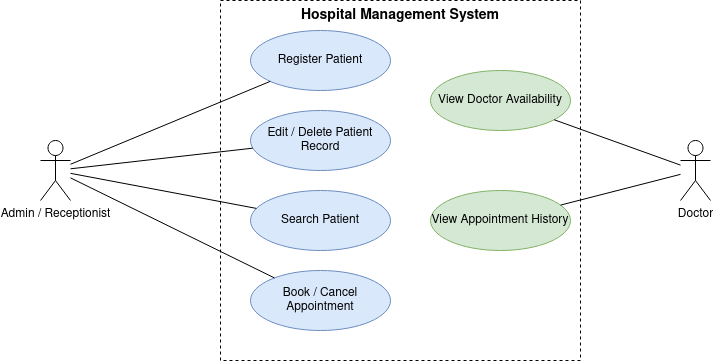

# 🏥 Hospital Management System (HMS)

> **Software Engineering Project — Team E13**  
> A modular, menu-driven digital healthcare record and appointment coordination system designed to replace fragmented physical registers and error-prone spreadsheets.

---

## 📌 1. Project Overview & Feasibility

### 1.1 Problem Statement
In many healthcare facilities and clinic environments, patient records and appointment schedules are still recorded manually on paper logs or across disconnected spreadsheets. This manual workflow creates substantial operational friction:
- **Retrieval Bottlenecks:** Staff spend critical minutes manually searching through archives to pull a patient's historical records.
- **Scheduling Conflicts & Double-Booking:** Fragmented booking logs result in overlapping appointments and frustrated patients.
- **Data Loss & Human Error:** Physical records suffer from physical degradation, misfiling, and duplicate data entry.
- **Coordination Gaps:** Inefficient communication between administrative receptionists and consulting doctors.

### 1.2 Proposed Solution & Feasibility
The **Hospital Management System (HMS)** addresses these challenges by offering a centralized, validated, and persistent console-based digital solution:
- **Operational Feasibility:** Streamlines day-to-day interactions for receptionists and doctors via an intuitive, menu-driven interface requiring zero prior technical training.
- **Technical Feasibility:** Developed with a modular architecture and reliable file-based persistence, ensuring lightweight resource requirements and high portability across operating systems.
- **Economic Feasibility:** Eliminates recurring SaaS licensing fees, paper log expenses, and hardware upgrade costs, running efficiently even on standard entry-level clinic workstations.

---

## 👥 2. System Stakeholders & Actors

| Actor | Role Type | Description & Responsibilities |
| :--- | :--- | :--- |
| **Admin / Receptionist** | Primary Direct Actor | Front-desk staff responsible for patient onboarding, updating patient profiles, managing directories, and scheduling/cancelling appointments. |
| **Doctor** | Primary Direct Actor | Medical practitioners who access the system to view daily consultation schedules, doctor availability rosters, and clinical visit history. |
| **Patient** | Indirect Actor | Clients receiving medical care whose information is securely managed and scheduled via the reception desk. |
| **System Daemon** | Internal Actor | Background automated processes managing file I/O persistence, data serialization, and input sanitation. |

---

## 📋 3. Software Requirements Specification 

1. **SRS-01 (Patient Onboarding):** The system shall allow administrators to register new patients with mandatory attributes (Patient ID, Full Name, Age, Gender, Contact Number, and Pre-existing Condition/Disease).
2. **SRS-02 (Record Modification):** The system shall allow authorized staff to update and edit existing patient contact and medical records.
3. **SRS-03 (Record Deletion):** The system shall allow safe deletion of inactive or archived patient records upon confirmation.
4. **SRS-04 (Patient Search):** The system shall provide fast indexed searching of patient records by unique Patient ID or partial Full Name.
5. **SRS-05 (Appointment Booking):** The system shall allow booking consultation appointments by associating a registered patient with a specific doctor and time slot.
6. **SRS-06 (Cancellation & Rescheduling):** The system shall support modifying, rescheduling, or cancelling booked appointments.
7. **SRS-07 (Doctor Rostering):** The system shall track and display real-time availability and assigned appointment rosters for each physician.
8. **SRS-08 (Consultation History):** The system shall generate, log, and display complete historical appointment records per patient.
9. **SRS-09 (Session Persistence):** The system shall automatically persist and synchronize all records to structured local file storage between sessions.
10. **SRS-10 (Data Validation):** The system shall enforce rigorous validation on all incoming inputs (e.g., non-empty required fields, numerical age boundaries, and valid phone formats).

---

## ⚙️ 4. Requirements Categorization

### 4.1 Functional Requirements (FRs)

| ID | Requirement Description | Target Actor |
| :---: | :--- | :--- |
| **FR1** | Add new patient record | Admin / Receptionist |
| **FR2** | Edit existing patient record | Admin / Receptionist |
| **FR3** | Delete patient record | Admin / Receptionist |
| **FR4** | Search patient record by ID or Name | Admin / Receptionist |
| **FR5** | Book new patient appointment with designated doctor | Admin / Receptionist |
| **FR6** | Cancel or reschedule existing appointment | Admin / Receptionist |
| **FR7** | View doctor availability and assigned consultation schedule | Doctor |
| **FR8** | View historical patient appointment logs | Doctor / Receptionist |

### 4.2 Non-Functional Requirements (NFRs)

| ID | Category | Specification / Metric |
| :---: | :--- | :--- |
| **NFR1** | **Performance** | System response time shall not exceed **2 seconds** for any record lookup or file read/write operation. |
| **NFR2** | **Reliability & Persistence** | All patient and booking data must reliably persist across sessions using robust local file-based storage. |
| **NFR3** | **Scalability** | The system must effortlessly handle at least **500 concurrent patient records** without degradation in speed or memory footprint. |
| **NFR4** | **Usability** | The interface shall provide a clear, numbered, menu-driven CLI with human-readable error prompts and guidance. |
| **NFR5** | **Robustness & Validation** | Robust input sanitation shall prevent program crashes, segmentation faults, or file corruption caused by malformed input. |
| **NFR6** | **Maintainability** | The codebase must adhere to modular programming paradigms with high cohesion and low coupling across modules. |

---

## 📊 5. Requirements Traceability Matrix (RTM)

| Req ID | Requirement Summary | Priority | Architectural Module | Test Case ID | Lifecycle Status |
| :---: | :--- | :---: | :--- | :---: | :---: |
| **FR1** | Add patient record | High | `Patient Module` | `TC01` | Planned |
| **FR2** | Edit patient record | High | `Patient Module` | `TC02` | Planned |
| **FR3** | Delete patient record | Medium | `Patient Module` | `TC03` | Planned |
| **FR4** | Search patient | High | `Patient Module` | `TC04` | Planned |
| **FR5** | Book appointment | High | `Appointment Module` | `TC05` | Planned |
| **FR6** | Cancel / reschedule appointment | Medium | `Appointment Module` | `TC06` | Planned |
| **FR7** | View doctor availability | Medium | `Doctor Module` | `TC07` | Planned |
| **FR8** | View appointment history | Low | `Appointment Module` | `TC08` | Planned |
| **NFR1** | Response time < 2s | High | `All Core Modules` | `TC09` | Planned |
| **NFR2** | Data persistence across sessions | High | `File I/O Module` | `TC10` | Planned |
| **NFR5** | Comprehensive input validation | High | `Validation Module` | `TC11` | Planned |

## 📐 6. System Architecture & Module Breakdown

The Hospital Management System follows a decoupled, modular design to ensure high maintainability, testability, and adherence to clean software engineering practices.

                           +---------------------------+
                           |     Main Menu / CLI       |
                           +-------------+-------------+
                                         |
         +-------------------------------+-------------------------------+
         |                               |                               |
+--------v---------+           +---------v--------+           +----------v--------+
|  Patient Module  |           | Appointment Mod. |           |   Doctor Module   |
+--------+---------+           +---------+--------+           +----------+--------+
         |                               |                               |
         +-------------------------------+-------------------------------+
                                         |
                     +-------------------+-------------------+
                     |                                       |
           +---------v---------+                   +---------v---------+
           | Validation Module |                   |  File I/O Module  |
           +-------------------+                   +---------+---------+
                                                             |
                                                   +---------v---------+
                                                   | Local Storage Files|
                                                   | (.txt / .csv / db)|
                                                   +-------------------+

### Module Descriptions
- *Patient Module*: Manages the patient lifecycle including registration, record modifications, record deletion, and search by ID or name.
- *Appointment Module*: Handles scheduling consultations, tracking doctor-patient mappings, slot cancellations, and patient visit histories.
- *Doctor Module*: Manages physician rosters, weekly schedules, department specializations, and consultation queue tracking.
- *File I/O & Persistence Module*: Encapsulates disk serialization and deserialization, ensuring crash-safe persistence between program runs.
- *Validation Module*: Centralized defensive input checking (e.g., verifying age boundaries, valid phone numbers, non-empty text fields, and duplicate key prevention).

---
---

## 🖼️ 7. Use Case & UML Modeling

The system architecture and actor interactions are documented in the [docs/uml.drawio](docs/uml.drawio) model:

### Actor-Use Case Mappings

#### *Admin / Receptionist*
- UC-01: Register Patient
- UC-02: Edit / Delete Patient Record
- UC-03: Search Patient
- UC-04: Book / Cancel Appointment

#### *Doctor*
- UC-05: View Doctor Availability
- UC-06: View Appointment History / Assigned Consultations

#### *System*
- Save & Load Data from Local File Storage
- Run Input Validation on Transactions

---
