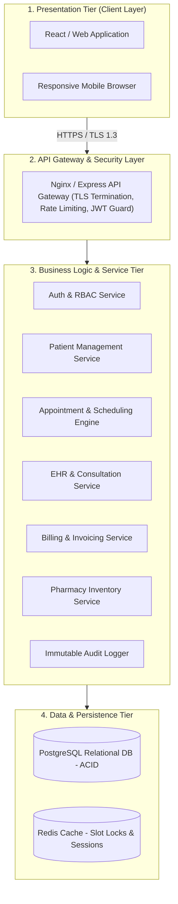
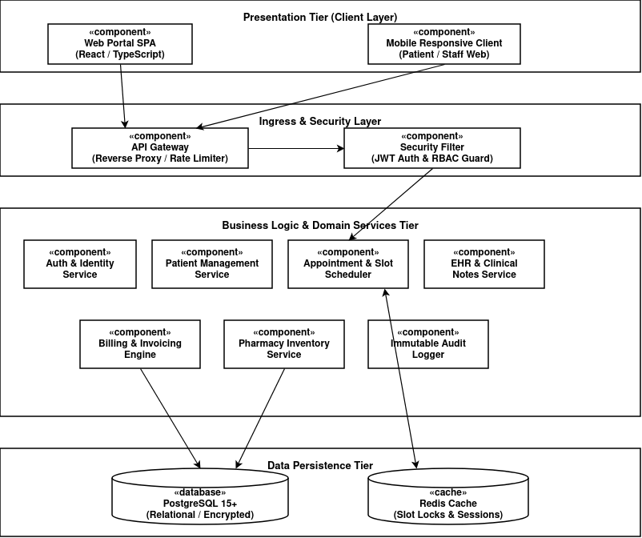
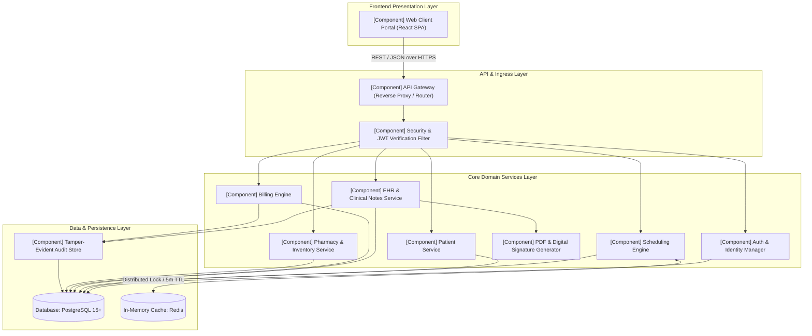
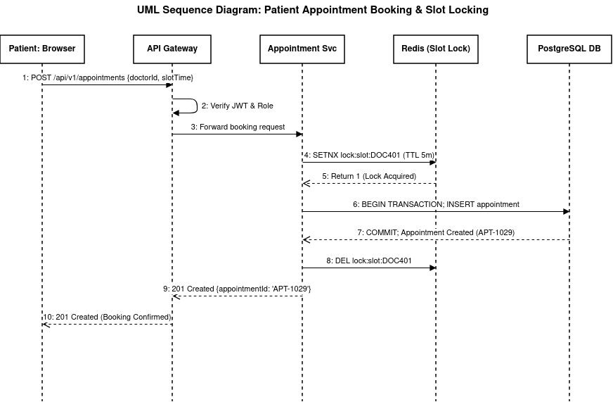
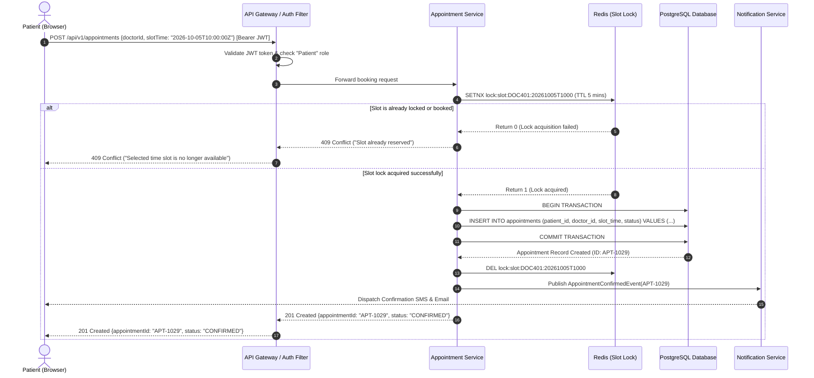
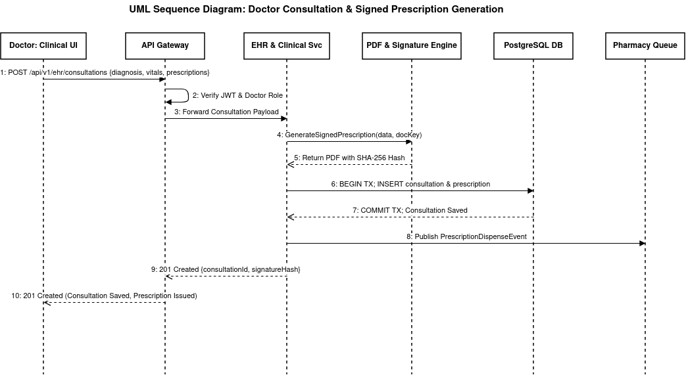
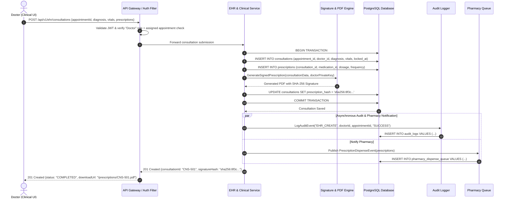
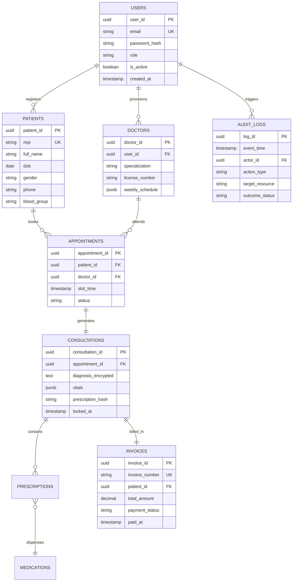
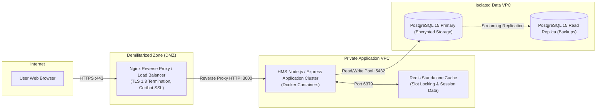

# Software Architecture & Design Specification (SADS)
## Hospital Management System (HMS)
**Document Standard:** IEEE Std 1016-2009 / ISO/IEC/IEEE 42010 Systems and Software Engineering — Architecture Description  
**Project:** Hospital Management System  
**Version:** 1.0  
**Date:** September 2026  

---

## Table of Contents
1. [Introduction](#1-introduction)
   - 1.1 [Purpose](#11-purpose)
   - 1.2 [Scope](#12-scope)
   - 1.3 [Definitions, Acronyms, and Abbreviations](#13-definitions-acronyms-and-abbreviations)
   - 1.4 [References](#14-references)
2. [Architectural Pattern & Representation](#2-architectural-pattern--representation)
   - 2.1 [Architectural Pattern Choice](#21-architectural-pattern-choice)
   - 2.2 [Pattern Rationale & Trade-off Analysis](#22-pattern-rationale--trade-off-analysis)
3. [Component Architecture & Decomposition](#3-component-architecture--decomposition)
   - 3.1 [UML Component Diagram](#31-uml-component-diagram)
   - 3.2 [Subsystem & Component Descriptions](#32-subsystem--component-descriptions)
4. [Traceability to Requirements](#4-traceability-to-requirements)
5. [Security Architecture](#5-security-architecture)
   - 5.1 [Defense-in-Depth Model](#51-defense-in-depth-model)
   - 5.2 [Authentication & Role-Based Access Control (RBAC)](#52-authentication--role-based-access-control-rbac)
   - 5.3 [Data Cryptography & Confidentiality](#53-data-cryptography--confidentiality)
   - 5.4 [Audit Logging Architecture](#54-audit-logging-architecture)
6. [Design View & Detailed Specifications](#6-design-view--detailed-specifications)
   - 6.1 [UML Sequence Diagram 1: Patient Appointment Booking Workflow](#61-uml-sequence-diagram-1-patient-appointment-booking-workflow)
   - 6.2 [UML Sequence Diagram 2: Doctor Consultation & EHR Prescription Workflow](#62-uml-sequence-diagram-2-doctor-consultation--ehr-prescription-workflow)
   - 6.3 [API Design](#63-api-design)
   - 6.4 [Error Handling Strategy](#64-error-handling-strategy)
   - 6.5 [Data Architecture & Entity Relationships](#65-data-architecture--entity-relationships)
   - 6.6 [Deployment & Infrastructure View](#66-deployment--infrastructure-view)

---

## 1. Introduction

### 1.1 Purpose
This document provides a comprehensive architectural and detailed design specification for the **Hospital Management System (HMS)** following the IEEE 1016-2009 standard. It translates the requirements outlined in the Software Requirements Specification ([`docs/SRS.md`](file:///home/abhijith/pes/sem5/se/docs/SRS.md)) into concrete structural, behavioral, interface, and data models for implementation and quality assurance.

### 1.2 Scope
The scope encompasses all architectural decisions, component interfaces, sequence workflows, RESTful API specifications, database models, security boundaries, and error recovery handling across the HMS platform.

### 1.3 Definitions, Acronyms, and Abbreviations
- **EHR**: Electronic Health Record
- **MPI**: Master Patient Index
- **RBAC**: Role-Based Access Control
- **PHI / PII**: Protected Health Information / Personally Identifiable Information
- **JWT**: JSON Web Token
- **REST**: Representational State Transfer
- **ACID**: Atomicity, Consistency, Isolation, Durability

### 1.4 References
1. IEEE Std 1016-2009: *Standard for Information Technology — Systems Design — Software Design Descriptions*.
2. ISO/IEC/IEEE 42010:2011: *Systems and software engineering — Architecture description*.
3. Software Requirements Specification for HMS ([`docs/SRS.md`](file:///home/abhijith/pes/sem5/se/docs/SRS.md)).
4. Software Test Plan for HMS ([`docs/Test_Plan.md`](file:///home/abhijith/pes/sem5/se/docs/Test_Plan.md)).

---

## 2. Architectural Pattern & Representation

### 2.1 Architectural Pattern Choice
The Hospital Management System adopts a **Tiered (Layered) Client-Server Architecture** organized as a **Modular Service-Oriented Core**. 



### 2.2 Pattern Rationale & Trade-off Analysis
1. **Clinical Data Isolation & HIPAA Compliance**: Strict separation between the Presentation, Business Logic, and Data Persistence tiers guarantees that sensitive health records cannot be directly reached by external clients without passing through the API Gateway authentication, rate limiting, and RBAC authorization filters.
2. **ACID Transaction Guarantees**: A relational core (PostgreSQL) is selected because financial billing, medicine inventory decrementing, and appointment slot locking require strict atomic integrity over eventual consistency.
3. **Independent Scalability**: High-frequency read queries (doctor availability slot searching) can be cached in Redis without burdening the primary EHR database containing intensive consultation histories.
4. **Maintainability & Modularity**: The modular service division allows individual domain modules (e.g., Billing or Pharmacy) to evolve independently or eventually transition into standalone microservices.

---

## 3. Component Architecture & Decomposition

### 3.1 UML Component Diagram


*(Source file: [`docs/diagrams/component_diagram.drawio`](file:///home/abhijith/pes/sem5/se/docs/diagrams/component_diagram.drawio))*



### 3.2 Subsystem & Component Descriptions

| Component Name | Primary Interface | Description & Functional Responsibility |
| :--- | :--- | :--- |
| **API Gateway & Filter** | Port 443 / HTTPS | Reverse proxy handling TLS termination, cross-origin request policies (CORS), rate limiting, request validation, and route dispatching. |
| **Auth & Identity Manager** | `/api/v1/auth/*` | Verifies user credentials, hashes passwords (bcrypt/Argon2id), issues signed JWT access tokens, and enforces RBAC permission matrices. |
| **Patient Service** | `/api/v1/patients/*` | Manages patient registration, demographic persistence, Master Patient Index (MPI) generation, and patient search indexing. |
| **Scheduling Engine** | `/api/v1/appointments/*` | Manages doctor rosters, slot generation, appointment reservations, and atomic slot lock acquisition via Redis to prevent double booking. |
| **EHR & Clinical Service** | `/api/v1/ehr/*` | Captures doctor clinical notes, diagnoses, prescriptions, and lab orders; enforces the 24-hour edit-lock and addendum constraints. |
| **Digital Signature Gen** | Internal Interface | Generates tamper-evident PDF prescriptions with SHA-256 HMAC verification signatures. |
| **Billing Engine** | `/api/v1/billing/*` | Computes consultation, lab, and medication line items; issues invoices; and integrates with payment webhook listeners. |
| **Pharmacy Service** | `/api/v1/pharmacy/*` | Receives verified prescriptions, facilitates medication dispensing, auto-decrements stock inventory, and flags low-stock warnings. |
| **Audit Logger** | Internal Interface | Asynchronously writes immutable audit events (timestamp, user, IP, action, resource) to write-only audit tables. |

---

## 4. Traceability to Requirements

| SRS Requirement ID | Requirement Summary | Architectural Component | Design Mechanism |
| :--- | :--- | :--- | :--- |
| **FR-AUTH-01 / 03** | Password complexity & JWT issuance | Auth & Identity Manager | Argon2id hashing + HMAC-SHA256 JWT tokens |
| **FR-AUTH-02** | Account lockout after 5 failures | Security & JWT Filter | In-memory failed attempt counter with 15m expiration |
| **FR-PAT-01 / 02** | MPI generation & demographics | Patient Service | Sequence-driven 10-digit MPI with unique DB index |
| **FR-APPT-02** | Atomic slot lock & double-booking | Scheduling Engine | Redis distributed lock (`SETNX`) with 5-minute TTL |
| **FR-EHR-01 / 03** | Clinical notes & 24h lock | EHR Service | Database timestamp triggers + addendum foreign keys |
| **FR-EHR-04** | Tamper-evident PDF prescription | Digital Signature Gen | SHA-256 cryptographic hash embedded in generated PDF |
| **FR-BILL-01 / 03** | Consolidated billing calculation | Billing Engine | Database transaction aggregating consultation + pharmacy items |
| **FR-PHARM-02 / 03**| Inventory decrement & alert | Pharmacy Service | Atomic SQL `UPDATE inventory SET stock = stock - qty` |
| **NFR-PERF-01** | <500ms latency under 200 users | API Gateway + Redis | Index-optimized queries + caching for doctor availability |
| **SEC-REQ-1.1** | Role-Based Access Control (RBAC) | Security Filter | Claims verification middleware evaluating endpoint privileges |
| **SEC-REQ-1.2** | Data at rest & transit encryption | Database & Gateway | AES-256 storage encryption + TLS 1.3 transport |
| **SEC-REQ-2.1** | Immutable Audit Log | Audit Logger | Append-only database table with no UPDATE/DELETE permissions |

---

## 5. Security Architecture

### 5.1 Defense-in-Depth Model
The HMS security architecture applies defense-in-depth across four distinct tiers:
1. **Edge / Perimeter**: TLS 1.3 encryption, IP rate limiting (100 req/min per IP), CORS restrictions, and WAF headers (`Content-Security-Policy`, `X-Frame-Options: DENY`).
2. **Application Boundary**: Stateless JWT authentication, role verification middleware, and strict request payload validation via JSON schemas.
3. **Domain Layer**: Object-level authorization (IDOR checks) verifying that the authenticated user owns or is assigned to the requested medical entity.
4. **Data Persistence**: Data-at-rest encryption (AES-256), least-privilege database user permissions, and write-only audit trails.

### 5.2 Authentication & Role-Based Access Control (RBAC)
User authorization operates via claims embedded in signed JWT tokens. The following RBAC permission matrix is enforced at the Gateway and Controller layers:

| Role | Patient Records | Appointments | Clinical Notes (EHR) | Billing Invoices | Pharmacy Inventory | Audit Logs |
| :--- | :--- | :--- | :--- | :--- | :--- | :--- |
| **Patient** | Read (Self Only) | Create / Read (Self) | Read (Self Only) | Read / Pay (Self) | No Access | No Access |
| **Doctor** | Read (Assigned) | Read / Manage (Self) | Create / Read / Addendum | Read (Basic) | Read Prescriptions | No Access |
| **Receptionist** | Create / Read (All) | Create / Read / Cancel | No Access | Create / Read / Pay | No Access | No Access |
| **Pharmacist** | No Access | No Access | Read Prescriptions Only | Read Associated Meds | Read / Update Stock | No Access |
| **Admin** | Read (De-identified) | Read All | No Access (Clinical) | Read All Financials | Read All | Read All Logs |

### 5.3 Data Cryptography & Confidentiality
- **Transit Security**: All external and internal service calls require HTTPS using TLS 1.3 with high-strength cipher suites (`TLS_AES_256_GCM_SHA384`).
- **Storage Security**: Sensitive clinical diagnoses, patient identification, and prescription notes are stored using AES-256 column-level encryption via PostgreSQL `pgcrypto`.

### 5.4 Audit Logging Architecture
Every request modifying or reading clinical and billing resources triggers an asynchronous event dispatched to the `Audit Logger`:
- **Captured Schema**: `{ log_id, event_timestamp, actor_user_id, client_ip, action_verb, target_resource, outcome_status }`.
- **Integrity**: Stored in a dedicated schema where SQL `UPDATE` and `DELETE` privileges are revoked for all operational database users.

---

## 6. Design View & Detailed Specifications

### 6.1 UML Sequence Diagram 1: Patient Appointment Booking Workflow


*(Source file: [`docs/diagrams/sequence_diagram_booking.drawio`](file:///home/abhijith/pes/sem5/se/docs/diagrams/sequence_diagram_booking.drawio))*



---

### 6.2 UML Sequence Diagram 2: Doctor Consultation & EHR Prescription Workflow


*(Source file: [`docs/diagrams/sequence_diagram_consultation.drawio`](file:///home/abhijith/pes/sem5/se/docs/diagrams/sequence_diagram_consultation.drawio))*



---

### 6.3 API Design

All endpoints communicate via JSON over HTTPS and adhere to REST conventions.

#### 1. `POST /api/v1/auth/login`
- **Description**: Authenticates user credentials and issues a signed JWT token.
- **Request Body**:
  ```json
  {
    "email": "doctor.smith@hospital.com",
    "password": "DocSecure#2026"
  }
  ```
- **Responses**:
  - `200 OK`:
    ```json
    {
      "status": "success",
      "data": {
        "accessToken": "eyJhbGciOiJIUzI1NiIsInR5cCI6IkpXVCJ9...",
        "tokenType": "Bearer",
        "expiresIn": 1800,
        "user": {
          "id": "USR-401",
          "name": "Dr. Sarah Smith",
          "role": "DOCTOR"
        }
      }
    }
    ```
  - `401 Unauthorized`: Invalid credentials.
  - `403 Forbidden`: Account locked due to failed attempts.

#### 2. `POST /api/v1/patients`
- **Description**: Registers a new patient and generates an MPI.
- **Headers**: `Authorization: Bearer <Token>` (Receptionist or Admin only)
- **Request Body**:
  ```json
  {
    "fullName": "Jane Doe",
    "dob": "1990-05-14",
    "gender": "FEMALE",
    "phone": "9876543210",
    "emergencyContact": "9876543211",
    "bloodGroup": "O+"
  }
  ```
- **Responses**:
  - `201 Created`: Returns patient object with assigned 10-digit `mpi`.
  - `400 Bad Request`: Validation failure on missing or malformed fields.

#### 3. `POST /api/v1/appointments`
- **Description**: Atomically reserves an appointment consultation slot.
- **Headers**: `Authorization: Bearer <Token>`
- **Request Body**:
  ```json
  {
    "patientId": "PAT-102",
    "doctorId": "DOC-401",
    "slotTime": "2026-10-05T10:00:00Z",
    "reasonForVisit": "Persistent fever and cough"
  }
  ```
- **Responses**:
  - `201 Created`: `{ "appointmentId": "APT-1029", "status": "CONFIRMED" }`
  - `409 Conflict`: `{ "status": "fail", "message": "Slot already reserved" }`

#### 4. `POST /api/v1/ehr/consultations`
- **Description**: Saves clinical examination findings and triggers signed digital prescription generation.
- **Headers**: `Authorization: Bearer <Doctor_Token>`
- **Request Body**:
  ```json
  {
    "appointmentId": "APT-1029",
    "patientId": "PAT-102",
    "vitals": {
      "bloodPressure": "120/80",
      "pulse": 72,
      "temperature": 98.6,
      "spo2": 99
    },
    "diagnosis": "Acute viral respiratory infection",
    "prescriptions": [
      {
        "medicationId": "MED-012",
        "name": "Paracetamol 500mg",
        "dosage": "1 tablet",
        "frequency": "TDS (3 times daily)",
        "durationDays": 5
      }
    ]
  }
  ```
- **Responses**:
  - `201 Created`: `{ "consultationId": "CNS-501", "signatureHash": "sha256:8f3c..." }`
  - `403 Forbidden`: User is not assigned doctor or record is locked.

#### 5. `POST /api/v1/billing/invoices`
- **Description**: Aggregates consultation and pharmacy costs into a final invoice.
- **Headers**: `Authorization: Bearer <Staff_Token>`
- **Request Body**:
  ```json
  {
    "patientId": "PAT-102",
    "consultationId": "CNS-501",
    "paymentMethod": "UPI",
    "amountPaid": 84.00
  }
  ```
- **Responses**:
  - `201 Created`: `{ "invoiceNumber": "INV-2026-9041", "status": "PAID", "totalAmount": 84.00 }`

---

## 6.4 Error Handling Strategy

### Standardized Error Representation (RFC 7807)
All error responses generated by the HMS platform conform strictly to the **RFC 7807 Problem Details** standard:

```json
{
  "type": "https://hms.hospital.com/errors/slot-already-booked",
  "title": "Conflict",
  "status": 409,
  "detail": "The requested appointment time slot for Doctor DOC-401 is no longer available.",
  "instance": "/api/v1/appointments",
  "invalidParams": []
}
```

### HTTP Status Code Taxonomy
| HTTP Code | Category | Application Trigger |
| :--- | :--- | :--- |
| **400 Bad Request** | Client Syntax | Malformed JSON, missing mandatory demographic fields. |
| **401 Unauthorized**| Authentication | Expired JWT, missing Bearer token header, or invalid signature. |
| **403 Forbidden**   | Authorization  | RBAC permission denied, non-assigned doctor accessing patient EHR. |
| **404 Not Found**   | Resource       | Requested patient MPI, appointment ID, or doctor ID does not exist. |
| **409 Conflict**    | State / Concurrency | Simultaneous slot booking attempt, duplicate patient registration. |
| **422 Unprocessable**| Semantic Validation | Consultation note submitted with date in the future. |
| **500 Internal Error**| Server Fault | Database connection failure, unhandled runtime exception. |

### Centralized Exception Handling Middleware
- All unhandled controller exceptions bubble up to a centralized Global Error Handler middleware.
- In production, internal stack traces and database schemas are stripped from error responses to prevent information disclosure.
- Database transactions use automatic `ROLLBACK` on any downstream error during multi-table writes.

---

## 6.5 Data Architecture & Entity Relationships



---

## 6.6 Deployment & Infrastructure View


