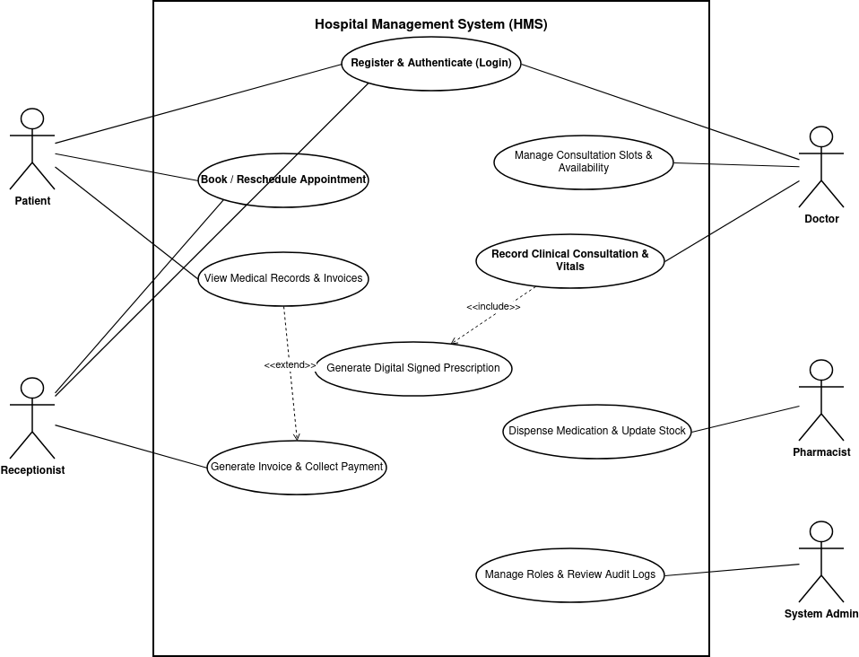
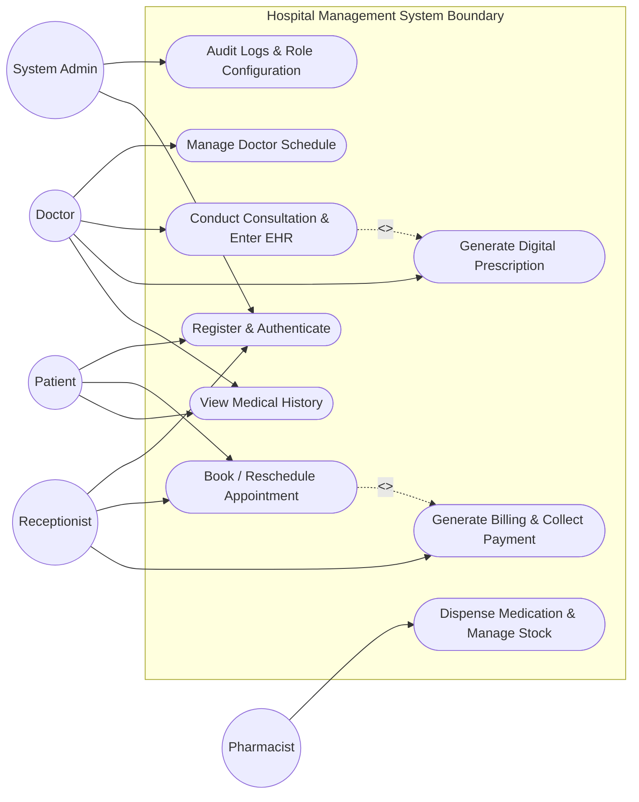

# Software Requirements Specification (SRS)
## Hospital Management System (HMS)
**Document Standard:** IEEE Std 830-1998 / ISO/IEC/IEEE 29148  
**Project:** Hospital Management System  
**Version:** 1.0  
**Date:** September 2026  

---

## Table of Contents
1. [Introduction](#1-introduction)
   - 1.1 [Purpose](#11-purpose)
   - 1.2 [Document Conventions](#12-document-conventions)
   - 1.3 [Intended Audience and Reading Suggestions](#13-intended-audience-and-reading-suggestions)
   - 1.4 [Project Scope](#14-project-scope)
   - 1.5 [References](#15-references)
2. [Overall Description](#2-overall-description)
   - 2.1 [Product Perspective](#21-product-perspective)
   - 2.2 [Product Functions](#22-product-functions)
   - 2.3 [User Classes and Characteristics](#23-user-classes-and-characteristics)
   - 2.4 [Operating Environment](#24-operating-environment)
   - 2.5 [Design and Implementation Constraints](#25-design-and-implementation-constraints)
   - 2.6 [Assumptions and Dependencies](#26-assumptions-and-dependencies)
3. [System Features and Functional Requirements](#3-system-features-and-functional-requirements)
   - 3.1 [Module 1: User Authentication & Role Management](#31-module-1-user-authentication--role-management)
   - 3.2 [Module 2: Patient Profile & Record Management](#32-module-2-patient-profile--record-management)
   - 3.3 [Module 3: Doctor Availability & Appointment Scheduling](#33-module-3-doctor-availability--appointment-scheduling)
   - 3.4 [Module 4: Electronic Health Records (EHR) & Consultations](#34-module-4-electronic-health-records-ehr--consultations)
   - 3.5 [Module 5: Billing & Invoicing](#35-module-5-billing--invoicing)
   - 3.6 [Module 6: Pharmacy & Medication Inventory](#36-module-6-pharmacy--medication-inventory)
4. [External Interface Requirements](#4-external-interface-requirements)
   - 4.1 [User Interfaces](#41-user-interfaces)
   - 4.2 [Hardware Interfaces](#42-hardware-interfaces)
   - 4.3 [Software Interfaces](#43-software-interfaces)
   - 4.4 [Communications Interfaces](#44-communications-interfaces)
5. [Non-Functional Requirements (NFRs)](#5-non-functional-requirements-nfrs)
   - 5.1 [Performance Requirements](#51-performance-requirements)
   - 5.2 [Reliability & Availability](#52-reliability--availability)
   - 5.3 [Maintainability & Scalability](#53-maintainability--scalability)
   - 5.4 [Usability](#54-usability)
6. [UML Use Case Diagram](#6-uml-use-case-diagram)
7. [Security Requirements Section](#7-security-requirements-section)
   - 7.1 [Security Objectives](#71-security-objectives)
   - 7.2 [Security Functional Requirements](#72-security-functional-requirements)

---

## 1. Introduction

### 1.1 Purpose
This Software Requirements Specification (SRS) provides a complete description of all functional, non-functional, security, and interface specifications for the **Hospital Management System (HMS)**. It serves as the primary contractual and technical agreement between project stakeholders, designers, developers, and quality assurance personnel.

### 1.2 Document Conventions
- Requirements are denoted with unique identifiers: `FR-[Module]-[ID]` for Functional Requirements and `NFR-[Category]-[ID]` for Non-Functional Requirements.
- The keywords **SHALL**, **MUST**, **SHOULD**, and **MAY** are to be interpreted in accordance with RFC 2119. Every requirement is specified to be concise, unambiguous, testable, and measurable.

### 1.3 Intended Audience and Reading Suggestions
- **Developers & Architects**: Review Sections 3, 4, 6, and 7 for architectural drivers and implementation details.
- **QA & Testing Engineers**: Use Section 3, 5, and 7 as the baseline for creating Test Plans, Test Cases, and Traceability Matrices.
- **Instructors & Evaluators**: Review Section 1.4 for scope boundaries, Section 6 for Use Cases, and Section 7 for Security alignment.

### 1.4 Project Scope
The Hospital Management System (HMS) is a centralized, secure web-based clinical and administrative management platform. The system automates patient intake, doctor slot allocation, consultation documentation, digital prescription handling, invoice calculation, and pharmaceutical stock tracking while maintaining strict data privacy compliance (HIPAA / Digital Personal Data Protection Act).

### 1.5 References
1. IEEE Std 830-1998: *Recommended Practice for Software Requirements Specifications*.
2. ISO/IEC/IEEE 29148:2018: *Systems and software engineering — Life cycle processes — Requirements engineering*.
3. Health Insurance Portability and Accountability Act (HIPAA) Security and Privacy Rules (45 CFR Part 160 and Part 164).

---

## 2. Overall Description

### 2.1 Product Perspective
HMS is a self-contained, three-tier cloud/web application replacing disparate manual hospital registers and legacy siloed software. It integrates directly with laboratory and pharmacy systems and exposes secure RESTful interfaces for external insurance clearinghouses and payment gateways.

### 2.2 Product Functions
- Role-based user authentication and identity verification.
- Patient onboarding, master demographic indexing, and medical history archiving.
- Doctor scheduling, real-time calendar synchronization, and slot locking.
- Electronic Health Record (EHR) capture with diagnostic coding and electronic prescription generation.
- Automated billing, fee tallying, discount authorization, and receipt issuance.
- Pharmacy inventory decrementing upon prescription dispensing.

### 2.3 User Classes and Characteristics
| User Class | Technical Expertise | Responsibilities & Privilege Scope |
| :--- | :--- | :--- |
| **System Administrator** | High | System configuration, account provisioning, role assignment, audit log monitoring, backup management. |
| **Doctor / Physician** | Moderate | Review assigned patient queues, document diagnoses, issue electronic prescriptions, order laboratory tests. |
| **Patient** | Low to Moderate | Book/reschedule appointments, view diagnostic summaries, download invoices and digital prescriptions. |
| **Receptionist / Front Desk** | Moderate | Register walk-in patients, verify insurance information, manage waiting lobby check-ins, collect payments. |
| **Pharmacist** | Moderate | Review verified prescriptions, dispense medications, update pharmaceutical inventory levels. |

### 2.4 Operating Environment
- **Server Tier**: Linux (Ubuntu 22.04 LTS / Debian 12), Node.js / Python Runtime, PostgreSQL 15+.
- **Client Tier**: Modern web browsers (Google Chrome 110+, Mozilla Firefox 110+, Safari 16+, Microsoft Edge) supporting HTML5, CSS3, and ECMAScript 2022+.
- **Network**: HTTPS over TLS 1.3 with standard broadband connectivity (minimum 2 Mbps uplink/downlink).

### 2.5 Design and Implementation Constraints
- Compliance with healthcare data residency and privacy mandates (HIPAA compliant auditing).
- Password policies complying with NIST SP 800-63B standards.
- Database operations involving medical records and billing must adhere to ACID transaction guarantees.

### 2.6 Assumptions and Dependencies
- Network connectivity between hospital clinics, front desk, and pharmacy terminals is reliable with 99.9% uptime.
- External payment gateway APIs maintain an SLA response time below 1.5 seconds.

---

## 3. System Features and Functional Requirements

### 3.1 Module 1: User Authentication & Role Management
- **FR-AUTH-01**: The system **SHALL** require all users to authenticate using a unique username/email and a password containing at least 8 characters (including uppercase, lowercase, number, and special character).
- **FR-AUTH-02**: The system **SHALL** lock user accounts for 15 minutes after 5 consecutive failed authentication attempts.
- **FR-AUTH-03**: The system **SHALL** issue a signed JSON Web Token (JWT) with an expiration time of 30 minutes upon successful authentication.
- **FR-AUTH-04**: The system **SHALL** enforce Role-Based Access Control (RBAC) ensuring users cannot access endpoints beyond their assigned role permissions.

### 3.2 Module 2: Patient Profile & Record Management
- **FR-PAT-01**: The system **SHALL** assign a unique 10-digit Master Patient Index (MPI) upon initial patient registration.
- **FR-PAT-02**: The system **SHALL** capture mandatory demographic fields: Full Name, Date of Birth, Gender, Contact Number, Emergency Contact, and Blood Group.
- **FR-PAT-03**: The system **SHALL** allow authorized receptionists and doctors to search patient records by MPI, phone number, or full name within 1.0 second.

### 3.3 Module 3: Doctor Availability & Appointment Scheduling
- **FR-APPT-01**: The system **SHALL** allow doctors to configure weekly availability schedules and 15-minute consultation slot intervals.
- **FR-APPT-02**: The system **SHALL** prevent double-booking by atomically locking an appointment slot upon initial selection for a maximum of 5 minutes during checkout.
- **FR-APPT-03**: The system **SHALL** allow patients and receptionists to cancel appointments at least 2 hours prior to the scheduled slot and immediately release the slot to the public pool.
- **FR-APPT-04**: The system **SHALL** trigger automated SMS and email notifications upon appointment confirmation, rescheduling, or cancellation.

### 3.4 Module 4: Electronic Health Records (EHR) & Consultations
- **FR-EHR-01**: The system **SHALL** restrict editing of clinical consultation notes exclusively to the assigned consulting doctor.
- **FR-EHR-02**: The system **SHALL** allow physicians to enter Chief Complaints, Vitals (BP, Pulse, Temperature, SpO2), Clinical Diagnosis, and Prescriptions.
- **FR-EHR-03**: The system **SHALL** lock consultation notes from further editing 24 hours after completion; any subsequent amendments must be appended as an addendum with timestamps.
- **FR-EHR-04**: The system **SHALL** generate a tamper-evident digital prescription in PDF format bearing a cryptographic SHA-256 verification hash.

### 3.5 Module 5: Billing & Invoicing
- **FR-BILL-01**: The system **SHALL** automatically calculate invoices aggregating consultation fees, diagnostic tests, and dispensed medications.
- **FR-BILL-02**: The system **SHALL** support multiple payment methods: Cash, Credit/Debit Card, and UPI.
- **FR-BILL-03**: The system **SHALL** mark an invoice as `PAID`, `PARTIAL`, or `PENDING` and generate a unique tax-compliant invoice number.

### 3.6 Module 6: Pharmacy & Medication Inventory
- **FR-PHARM-01**: The system **SHALL** display verified digital prescriptions directly to the hospital pharmacy dispensary queue.
- **FR-PHARM-02**: The system **SHALL** decrement medicine batch inventory levels automatically when the pharmacist marks a prescription as `DISPENSED`.
- **FR-PHARM-03**: The system **SHALL** trigger an administrative low-stock alert when an item's quantity falls below a configurable threshold.

---

## 4. External Interface Requirements

### 4.1 User Interfaces
- Responsive Web UI with desktop and mobile viewpoints (1920x1080 down to 375x667).
- Strict adherence to WCAG 2.1 AA accessibility standards (contrast ratios >= 4.5:1).

### 4.2 Hardware Interfaces
- Standard thermal receipt and barcode/label printers via USB or network protocols (ESC/POS).

### 4.3 Software Interfaces
- **Database**: PostgreSQL 15+ relational database connected via encrypted pool connections.
- **Payment Gateway**: Integration with Stripe / Razorpay via RESTful webhooks.

### 4.4 Communications Interfaces
- All client-server communications **SHALL** utilize HTTPS over TLS 1.3.
- Asynchronous notifications **SHALL** use SMTP over TLS (port 587) and RESTful SMS gateway APIs.

---

## 5. Non-Functional Requirements (NFRs)

### 5.1 Performance Requirements
- **NFR-PERF-01**: The system **SHALL** respond to 95% of standard database read requests (e.g., patient search, appointment slot retrieval) in under 500 milliseconds under a concurrent load of 200 active users.
- **NFR-PERF-02**: Ingestion of EHR records and PDF generation **SHALL** complete within 2.0 seconds.

### 5.2 Reliability & Availability
- **NFR-REL-01**: The system **SHALL** maintain a minimum uptime of 99.9% (less than 8.76 hours of unplanned downtime per year).
- **NFR-REL-02**: Database backups **SHALL** be executed automatically every 24 hours with an RPO (Recovery Point Objective) <= 1 hour and RTO (Recovery Time Objective) <= 4 hours.

### 5.3 Maintainability & Scalability
- **NFR-MAINT-01**: The system architecture **SHALL** follow modular separation of concerns such that individual services can be containerized and scaled horizontally.
- **NFR-MAINT-02**: Codebase **SHALL** maintain unit test coverage of at least 80% on business logic modules.

### 5.4 Usability
- **NFR-USE-01**: A newly onboarded receptionist **SHALL** be capable of completing a patient registration and appointment booking within 3 minutes without supervisor intervention.

---

## 6. UML Use Case Diagram

*(Source file: [`docs/diagrams/use_case_diagram.drawio`](file:///home/abhijith/pes/sem5/se/docs/diagrams/use_case_diagram.drawio))*

---

## 7. Security Requirements Section

### 7.1 Security Objectives
1. **Objective 1 (Confidentiality & Data Privacy)**: Protect Protected Health Information (PHI) and Personal Identifiable Information (PII) against unauthorized disclosure, interception, or accidental data spillage in adherence with HIPAA and privacy regulations.
2. **Objective 2 (Integrity, Non-Repudiation & Auditability)**: Guarantee that all medical records, prescription edits, clinical notes, and billing transactions are authentic, tamper-evident, non-repudiable, and fully traceable to verified user actions.

### 7.2 Security Functional Requirements

#### Requirements under Objective 1 (Confidentiality & Privacy):
- **SEC-REQ-1.1 (Role-Based Access Control - RBAC)**: The system **SHALL** enforce granular authorization policies wherein patients may only view their personal records, doctors may only access records of currently assigned patients, and administrative staff are restricted from clinical diagnosis notes.
- **SEC-REQ-1.2 (Cryptographic Protection at Rest and in Transit)**: The system **SHALL** encrypt all patient medical records, vitals, and credentials at rest using AES-256-GCM. All communications across public and internal networks **SHALL** be encrypted using TLS 1.3 with Forward Secrecy.

#### Requirements under Objective 2 (Integrity & Auditability):
- **SEC-REQ-2.1 (Immutable Audit Logging)**: The system **SHALL** maintain an append-only, tamper-evident audit log recording every create, read, update, and delete (CRUD) action performed on EHR and billing data. Each log entry **SHALL** record: Timestamp (UTC), User ID, Client IP, Resource ID, Action Type, and Result Status.
- **SEC-REQ-2.2 (Digital Signatures & Tamper Prevention)**: Every clinical prescription and discharge summary **SHALL** be cryptographically signed using the prescribing physician's private key / HMAC-SHA256 signature token to prevent post-consultation repudiation or prescription tampering.
