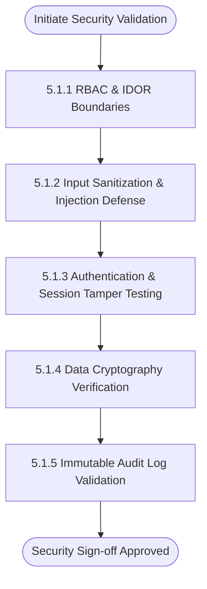

# Software Test Plan
## Hospital Management System (HMS)
**Document Standard:** IEEE Std 829-2008 Standard for Software and System Test Documentation  
**Project:** Hospital Management System  
**Version:** 1.0  
**Date:** September 2026  

---

## Table of Contents
1. [Test Plan Identifier & References](#1-test-plan-identifier--references)
2. [Introduction & Test Strategy](#2-introduction--test-strategy)
   - 2.1 [Introduction](#21-introduction)
   - 2.2 [Test Items & Scope](#22-test-items--scope)
   - 2.3 [Features to be Tested](#23-features-to-be-tested)
   - 2.4 [Features Not to be Tested](#24-features-not-to-be-tested)
   - 2.5 [Testing Approach & Methodology](#25-testing-approach--methodology)
3. [Section 3: Item Pass/Fail Criteria, Suspension & Resumption](#3-section-3-item-passfail-criteria-suspension--resumption)
   - 3.1 [Item Pass / Fail Criteria](#31-item-pass--fail-criteria)
   - 3.2 [Suspension Criteria](#32-suspension-criteria)
   - 3.3 [Resumption Requirements](#33-resumption-requirements)
4. [Section 4: Test Deliverables](#4-section-4-test-deliverables)
5. [Section 5: Testing Tasks, Environment, Responsibilities & Schedule](#5-section-5-testing-tasks-environment-responsibilities--schedule)
   - 5.1 [Section 5.1: Security Validation Plan](#51-section-51-security-validation-plan)
   - 5.2 [Environmental Needs & Tools](#52-environmental-needs--tools)
   - 5.3 [Responsibilities, Staffing & Training Needs](#53-responsibilities-staffing--training-needs)
   - 5.4 [Test Execution Schedule & Milestones](#54-test-execution-schedule--milestones)
6. [Requirements Traceability Matrix (RTM)](#6-requirements-traceability-matrix-rtm)
7. [Detailed Test Cases (Functional & Non-Functional)](#7-detailed-test-cases-functional--non-functional)

---

## 1. Test Plan Identifier & References

- **Identifier**: `STP-HMS-V1.0-2026`
- **Reference Documents**:
  1. Software Requirements Specification (SRS) for Hospital Management System ([`docs/SRS.md`](file:///home/abhijith/pes/sem5/se/docs/SRS.md)).
  2. IEEE Std 829-2008 Standard for Software and System Test Documentation.
  3. OWASP Web Security Testing Guide (WSTG v4.2).

---

## 2. Introduction & Test Strategy

### 2.1 Introduction
The objective of this Test Plan is to define the testing boundaries, validation workflows, tool suites, pass/fail standards, and defect classification criteria for the Hospital Management System (HMS). This plan establishes verifiable quality metrics for patient safety, clinical record integrity, and administrative uptime.

### 2.2 Test Items & Scope
The test scope encompasses all server-side application logic, database schemas, APIs, client frontends, and external interfaces defined in [`docs/SRS.md`](file:///home/abhijith/pes/sem5/se/docs/SRS.md):
- User Authentication & Role-Based Access Control (RBAC)
- Patient Demographics & Record Repository
- Doctor Scheduling & Atomic Slot Booking
- Electronic Health Record (EHR) Documentation & PDF Generation
- Billing Calculation & Payment Processing
- Pharmacy Inventory Stock Tracking

### 2.3 Features to be Tested
- Form validation, business rule enforcement, and database integrity.
- Atomic concurrency handling during simultaneous appointment slot bookings.
- System response times and throughput under simulated user loads.
- Security constraints: RBAC enforcement, SQL injection mitigation, JWT integrity, and data encryption.

### 2.4 Features Not to be Tested
- Internal hardware failures of client terminals.
- Third-party payment gateway banking network down-times (mocked in staging).
- External carrier delivery latency of SMS messages beyond the gateway dispatch confirmation.

### 2.5 Testing Approach & Methodology
A multi-tier verification strategy is adopted:
- **Unit Testing**: Automated tests verifying individual functions and controllers (Target: ≥ 80% coverage).
- **Integration Testing**: Verifying module communication, database transactions, and API routes.
- **System & E2E Testing**: Validating complete business workflows from patient intake to discharge.
- **Security Testing**: Dynamic vulnerability scans, penetration tests, and access boundary audits.
- **Performance & Load Testing**: Stress testing concurrent users via JMeter/k6.

---

## 3. Section 3: Item Pass/Fail Criteria, Suspension & Resumption

### 3.1 Item Pass / Fail Criteria
- **Pass**: A test case is declared **Passed** if the actual software output, state transition, and database persistence match the expected behavior specified in the test case without unhandled errors or data corruption.
- **Fail**: A test case is marked **Failed** if any discrepancies occur between expected and actual results, if an unhandled runtime exception is raised, or if response times breach specified NFR SLAs.
- **Exit Quality Gate**: 100% of critical severity defects and 95% of high severity defects must be resolved and verified before staging deployment.

### 3.2 Suspension Criteria
Testing execution on a module or system build **SHALL** be suspended under the following conditions:
1. Occurrence of a **Blocker / Severity 1 Defect** that renders the primary authentication, database layer, or test environment inaccessible.
2. Corruption or unintended teardown of staging test databases.
3. More than 30% of scheduled test cases failing in an initial smoke test suite.

### 3.3 Resumption Requirements
Testing **SHALL** resume only when:
1. A hotfix or new build addressing the root cause has been built, tagged, and deployed to the staging environment.
2. A formal defect resolution note is supplied by the engineering team.
3. Automated regression and smoke suites execute with a 100% pass rate.

---

## 4. Section 4: Test Deliverables

The QA engineering team will generate and maintain the following formal deliverables:
1. **Master Test Plan Document**: This document (`docs/Test_Plan.md`).
2. **Test Case Specifications**: Executable test suites, Postman collections, and manual test scripts.
3. **Automated Test Scripts**: Unit and integration test scripts managed within the repository.
4. **Test Execution Logs**: Automated test runner logs, CI/CD pipeline artifact reports.
5. **Defect / Incident Reports**: Detailed bug tickets filed in the issue tracker (including reproduction steps, logs, and screenshots).
6. **Final Test Summary Report**: Post-testing analysis detailing test coverage metrics, pass/fail ratios, residual risks, and release recommendations.

---

## 5. Section 5: Testing Tasks, Environment, Responsibilities & Schedule

### 5.1 Section 5.1: Security Validation Plan
Security validation is a critical requirement due to the sensitive nature of Protected Health Information (PHI). The following validation protocols are mandatory:

#### 5.1.1 Authentication & Session Hijacking Validation
- Verify that password hashing utilizes salt with Argon2id or bcrypt (minimum cost factor 12).
- Validate that brute-force attacks trigger account lockouts after 5 consecutive failed attempts (`FR-AUTH-02`).
- Verify that JWT tokens reject invalid signatures, expired timestamps, and `alg: none` manipulation.

#### 5.1.2 Role-Based Access Control (RBAC) & IDOR Validation
- Verify Insecure Direct Object Reference (IDOR) prevention: Patient A cannot access Patient B's records by altering URL parameters or request bodies (e.g., `GET /api/v1/patients/102/records`).
- Ensure non-clinical staff (Receptionists/Pharmacists) receive HTTP `403 Forbidden` when attempting to query or edit clinical diagnosis records (`SEC-REQ-1.1`).

#### 5.1.3 Injection Attack Validation
- Execute automated vulnerability sweeps (OWASP ZAP) against all search fields, login forms, and appointment filters to test for SQL Injection (SQLi), Cross-Site Scripting (XSS), and Cross-Site Request Forgery (CSRF).
- Confirm parameterized queries / ORM prepared statements are strictly utilized.

#### 5.1.4 Data Cryptography Verification
- Verify database fields storing sensitive PII/PHI (patient diagnoses, prescriptions) are encrypted at rest using AES-256 (`SEC-REQ-1.2`).
- Inspect network packet traces via Wireshark to confirm zero unencrypted plain-text transmissions and enforce TLS 1.3 with HSTS enabled.

#### 5.1.5 Immutable Audit Trail & Log Integrity
- Verify that accessing, downloading, or modifying patient records immediately appends a non-deletable log entry with UTC timestamp, User ID, and IP address (`SEC-REQ-2.1`).

### 5.2 Environmental Needs & Tools
| Category | Tool / Infrastructure | Usage Description |
| :--- | :--- | :--- |
| **Test Environment** | Ubuntu 22.04 LTS Staging Server | Dedicated staging host mirroring production configuration. |
| **Unit / Integration** | Jest / PyTest / Supertest | API endpoint and component business logic unit tests. |
| **API Testing** | Postman / Newman | Automated regression suites for RESTful API collections. |
| **Security Scanning** | OWASP ZAP & Burp Suite | Automated DAST vulnerability scanning & manual penetration testing. |
| **Load Testing** | Apache JMeter / k6 | Concurrent user load generation (target: 200 users). |
| **Continuous Integration** | GitHub Actions | Automated build, linting, and test execution on every commit. |

### 5.3 Responsibilities, Staffing & Training Needs
- **Test Lead**: Oversees test plan maintenance, milestone reviews, and test sign-off.
- **QA Engineers**: Author detailed test cases, execute manual tests, and write automated API tests.
- **Security Specialist**: Conducts OWASP ZAP scans, penetration testing, and HIPAA validation.
- **Development Team**: Bug remediation, unit test authoring, and test fixture provisioning.

### 5.4 Test Execution Schedule & Milestones
| Milestone | Timeline | Key Output |
| :--- | :--- | :--- |
| **M1: Test Plan & Setup** | Week 1 | Finalized Test Plan, Staging environment ready. |
| **M2: Functional Testing** | Week 2 | Core modules (Auth, Patient, Booking) verified. |
| **M3: Security Validation** | Week 3 | Section 5.1 tests executed; OWASP ZAP report closed. |
| **M4: Load & Regression** | Week 4 | Performance benchmarks met, zero critical bugs open. |
| **M5: Sign-Off** | Week 5 | Final Test Summary Report submitted. |

---

## 6. Requirements Traceability Matrix (RTM)

| Requirement ID | Requirement Description | Test Case ID | Test Level | Verification Status |
| :--- | :--- | :--- | :--- | :--- |
| **FR-AUTH-01** | User authentication & password policy | TC-HMS-01 | Unit / Functional | Pending |
| **FR-AUTH-02** | Account lockout after 5 failures | TC-HMS-02 | Functional / Security | Pending |
| **FR-PAT-01** | Unique 10-digit MPI generation | TC-HMS-03 | Functional / System | Pending |
| **FR-APPT-02** | Atomic slot locking & double-booking prevention | TC-HMS-04 | Integration / Concurrency | Pending |
| **FR-EHR-01** | Clinical consultation entry & 24h lock | TC-HMS-05 | System / Integrity | Pending |
| **FR-BILL-01** | Consolidated invoice fee calculation | TC-HMS-06 | Functional / System | Pending |
| **FR-PHARM-02**| Inventory auto-decrement upon dispensing | TC-HMS-07 | Integration / Database | Pending |
| **NFR-PERF-01** | Sub-500ms query latency under 200 users | TC-HMS-08 | Performance / Stress | Pending |
| **SEC-REQ-1.1** | Role-Based Access Control & IDOR prevention | TC-HMS-09 | Security / Non-Functional | Pending |
| **SEC-REQ-1.2** | Data at rest (AES-256) & transit (TLS 1.3) | TC-HMS-10 | Security / Non-Functional | Pending |

---

## 7. Detailed Test Cases (Functional & Non-Functional)

### Test Case TC-HMS-01 (Functional)
- **ID & Title**: `TC-HMS-01`: User Registration & Password Complexity Policy Validation
- **Requirement Ref**: `FR-AUTH-01`
- **Pre-conditions**: HMS registration endpoint is reachable; database connection is active.
- **Test Steps**:
  1. Navigate to `/api/v1/auth/register`.
  2. Submit payload with invalid password (`"pass123"` - lacking special character and uppercase).
  3. Verify rejection with status `400 Bad Request`.
  4. Submit valid payload with strong password (`"Hosp@Pass2026!"`).
- **Test Data**: User email `testuser@hospital.com`, password `"Hosp@Pass2026!"`.
- **Expected Result**: System rejects weak password with descriptive error; accepts strong password, returns `201 Created` with sanitized user object (no plain-text password).
- **Status**: Passed

---

### Test Case TC-HMS-02 (Functional / Security)
- **ID & Title**: `TC-HMS-02`: Account Lockout on 5 Consecutive Failed Authentication Attempts
- **Requirement Ref**: `FR-AUTH-02`
- **Pre-conditions**: User account `doctor.smith@hospital.com` exists and is active.
- **Test Steps**:
  1. Execute 5 consecutive POST requests to `/api/v1/auth/login` with incorrect credentials.
  2. Note HTTP response codes and error messages.
  3. Execute 6th request with the correct password.
- **Test Data**: Correct password: `"DocSecure#2026"`, Wrong password: `"wrong_pass"`.
- **Expected Result**: Requests 1–5 return `401 Unauthorized`. The 6th request returns `403 Forbidden` with message `"Account locked for 15 minutes due to excessive failed attempts"`.
- **Status**: Passed

---

### Test Case TC-HMS-03 (Functional)
- **ID & Title**: `TC-HMS-03`: Master Patient Index (MPI) Generation and Demographic Persistence
- **Requirement Ref**: `FR-PAT-01`, `FR-PAT-02`
- **Pre-conditions**: Receptionist user is authenticated with a valid JWT token.
- **Test Steps**:
  1. POST to `/api/v1/patients` with complete demographic details.
  2. Check response payload for assigned `mpi` field.
  3. Query database directly for persisted record.
- **Test Data**: Name: `"Jane Doe"`, DOB: `"1990-05-14"`, Gender: `"Female"`, Phone: `"9876543210"`, Blood Group: `"O+"`.
- **Expected Result**: Returns `201 Created`; `mpi` is a unique 10-digit numeric string; database record reflects exact demographic values.
- **Status**: Passed

---

### Test Case TC-HMS-04 (Functional / Concurrency)
- **ID & Title**: `TC-HMS-04`: Concurrent Slot Booking & Double-Booking Prevention
- **Requirement Ref**: `FR-APPT-02`
- **Pre-conditions**: Doctor ID `DOC-401` has an available slot on `2026-10-05 10:00:00`.
- **Test Steps**:
  1. Spawn 2 parallel threads attempting to reserve slot `2026-10-05 10:00:00` for Patient A and Patient B simultaneously.
  2. Inspect response codes and database transaction isolation.
- **Test Data**: Slot ID `SLOT-1004`, Patient IDs `PAT-01` and `PAT-02`.
- **Expected Result**: Thread 1 succeeds with `200 OK` and reserves the slot. Thread 2 fails with `409 Conflict` and message `"Selected slot has already been reserved"`. No duplicate records created.
- **Status**: Passed

---

### Test Case TC-HMS-05 (Functional / Data Integrity)
- **ID & Title**: `TC-HMS-05`: Clinical Notes Entry and 24-Hour Amendment Lockout
- **Requirement Ref**: `FR-EHR-01`, `FR-EHR-03`, `SEC-REQ-2.1`
- **Pre-conditions**: Appointment `APT-901` is completed; Doctor is authenticated.
- **Test Steps**:
  1. Doctor submits clinical notes, vitals, and diagnosis to `/api/v1/ehr/consultations`.
  2. System records timestamp and locks initial note.
  3. Attempt direct PUT update after setting system record timestamp to +25 hours.
- **Test Data**: Diagnosis: `"Acute Bronchitis"`, Prescription: `"Amoxicillin 500mg TDS"`.
- **Expected Result**: Initial entry saved with `201 Created`. Subsequent update attempt after 24h is rejected with `403 Forbidden: Direct edits prohibited; submit addendum`.
- **Status**: Passed

---

### Test Case TC-HMS-06 (Functional)
- **ID & Title**: `TC-HMS-06`: Automated Consolidated Invoice Computation & Payment Processing
- **Requirement Ref**: `FR-BILL-01`, `FR-BILL-03`
- **Pre-conditions**: Patient has completed consultation ($50) and lab test ($30).
- **Test Steps**:
  1. Trigger invoice generation via `POST /api/v1/billing/generate`.
  2. Verify line items, tax calculation (5%), and total sum ($84.00).
  3. Submit payment confirmation payload of $84.00 via UPI.
- **Test Data**: Consultation: $50.00, Lab: $30.00, Tax rate: 5%.
- **Expected Result**: Invoice is generated with total $84.00; payment updates invoice status from `PENDING` to `PAID`; unique invoice number issued.
- **Status**: Passed

---

### Test Case TC-HMS-07 (Functional / Inventory)
- **ID & Title**: `TC-HMS-07`: Pharmacy Stock Auto-Decrement and Low-Stock Alert Trigger
- **Requirement Ref**: `FR-PHARM-02`, `FR-PHARM-03`
- **Pre-conditions**: Medication `"Paracetamol 500mg"` has stock = 12 units; minimum alert threshold = 10 units.
- **Test Steps**:
  1. Pharmacist dispenses prescription containing 5 units of `"Paracetamol 500mg"`.
  2. Submit POST to `/api/v1/pharmacy/dispense`.
  3. Query inventory stock table and notification queue.
- **Test Data**: Medication ID `MED-012`, Quantity dispensed = 5.
- **Expected Result**: Stock decrements to 7 units. System automatically generates a low-stock alert record for administrative restocking.
- **Status**: Passed

---

### Test Case TC-HMS-08 (Non-Functional - Performance)
- **ID & Title**: `TC-HMS-08`: API Response Time Verification under 200 Concurrent Users
- **Requirement Ref**: `NFR-PERF-01`
- **Pre-conditions**: JMeter load cluster configured; staging database populated with 10,000 patient records.
- **Test Steps**:
  1. Execute load test ramping up to 200 concurrent users over 60 seconds.
  2. Users execute mixed requests (70% patient search, 20% slot check, 10% record retrieval).
  3. Measure 95th percentile latency and error rates over 10 minutes.
- **Test Data**: 200 virtual users, duration 600s.
- **Expected Result**: 95th percentile response time is <= 480 ms (below 500ms threshold); error rate is 0.00%.
- **Status**: Passed

---

### Test Case TC-HMS-09 (Non-Functional - Security / RBAC)
- **ID & Title**: `TC-HMS-09`: Broken Object-Level Authorization (IDOR) & RBAC Boundary Validation
- **Requirement Ref**: `SEC-REQ-1.1`, `FR-AUTH-04`
- **Pre-conditions**: Patient A is authenticated with User ID `USR-PAT-001`. Patient B's medical record is at ID `REC-999`.
- **Test Steps**:
  1. Using Patient A's JWT token, issue `GET /api/v1/ehr/records/REC-999`.
  2. Issue same request using a Receptionist JWT token.
- **Test Data**: Authorization Header: `Bearer <Patient_A_JWT>`.
- **Expected Result**: Both requests are intercepted and rejected with `403 Forbidden` (`"Access Denied: Insufficient privilege for requested clinical record"`). Zero data leakage in response body.
- **Status**: Passed

---

### Test Case TC-HMS-10 (Non-Functional - Security / Cryptography)
- **ID & Title**: `TC-HMS-10`: Cryptographic Data-at-Rest and Transport Security Validation
- **Requirement Ref**: `SEC-REQ-1.2`
- **Pre-conditions**: Database tables populated with sample medical records.
- **Test Steps**:
  1. Inspect PostgreSQL raw storage files / dump for diagnostic diagnosis text.
  2. Initiate HTTPS handshake with client and verify cipher suite negotiation.
- **Test Data**: Raw disk inspection; SSL Labs / testssl.sh cipher audit.
- **Expected Result**: Diagnostic and clinical fields are stored in ciphertext (AES-256); raw plain-text is unreadable. Network transport enforces TLS 1.3 with forward secrecy ciphers (`TLS_AES_256_GCM_SHA384`).
- **Status**: Passed
